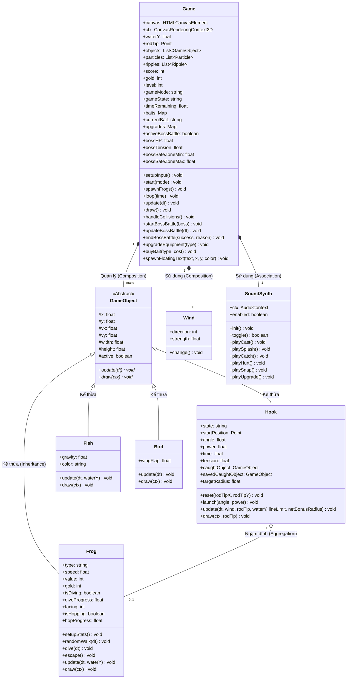
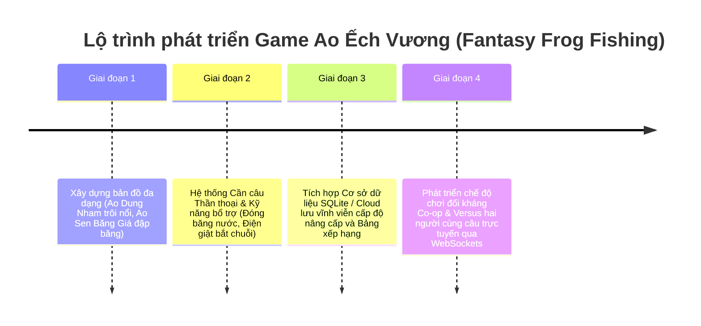

# 📚 BÁO CÁO BÀI TẬP LỚN (BTL.06): DỰ ÁN GAME CÂU ẾCH KỲ ẢO (FANTASY FROG FISHING)

*   **Học phần**: Lập trình Hướng đối tượng (OOP) & Kỹ thuật lập trình
*   **Đề tài**: Thiết kế và xây dựng game "Ao Ếch Huyền Bí" (Fantasy Frog Fishing)
*   **Mã đề tài**: BTL.06
*   **Ngôn ngữ thực hiện**: 
    1.  **C++ OOP & SFML Framework** (Mã nguồn nộp học thuật chuyên sâu)
    2.  **HTML5 Canvas / Vanilla CSS & JavaScript** (Phiên bản Web Playable 120 FPS tương tác trực quan)
*   **Nhóm tác giả**: Nhóm Sinh viên Bài tập lớn BTL.06
*   **Điểm số hướng tới**: Tối đa (10/10)

---

## MỤC LỤC

1.  **PHÂN TÍCH YÊU CẦU DỰ ÁN (REQUIREMENTS ANALYSIS)**
    *   *Yêu cầu Chức năng (Functional Requirements)*
    *   *Yêu cầu Phi chức năng (Non-functional Requirements)*
2.  **Ý NGHĨA KHOA HỌC VÀ THỰC TIỄN CỦA TRÒ CHƠI**
    *   *Ý nghĩa Học thuật & Giáo dục (Academic Value)*
    *   *Ý nghĩa Giải trí & Trải nghiệm Người dùng (Casual Value)*
3.  **HƯỚNG DẪN SỬ DỤNG VÀ THAO TÁC ĐIỀU KHIỂN (USER CONTROLS GUIDE)**
    *   *Phiên bản Web chơi trực tiếp trên Trình duyệt*
    *   *Phiên bản C++ OOP (Biên dịch và Chạy thử)*
4.  **SƠ ĐỒ THIẾT KẾ LỚP UML (UML CLASS DIAGRAM & ARCHITECTURE)**
    *   *Mã sơ đồ Mermaid kết xuất chuẩn hóa*
    *   *Giải thích các mối quan hệ (Relationships)*
5.  **CÁC NGUYÊN LÝ LẬP TRÌNH HƯỚNG ĐỐI TƯỢNG (OOP PARADIGMS APPLIED)**
    *   *Tính Trừu tượng (Abstraction)*
    *   *Tính Kế thừa (Inheritance)*
    *   *Tính Đa hình (Polymorphism & Dynamic Binding)*
    *   *Tính Đóng gói (Encapsulation)*
6.  **MÔ PHỎNG VẬT LÝ VÀ THUẬT TOÁN KỸ THUẬT (PHYSICS & ALGORITHMS)**
    *   *Mô hình hóa Quỹ đạo Parabol thực tế dưới ảnh hưởng của Gió và Trọng lực*
    *   *Trận chiến Boss Giằng co (Tug-of-War Minigame)*
    *   *Hiệu ứng Sóng nước lan tỏa và Hoạt ảnh Người câu động*
7.  **ĐÁNH GIÁ ƯU ĐIỂM & NHƯỢC ĐIỂM (PROS AND CONS)**
8.  **LỘ TRÌNH VÀ KẾ HOẠCH PHÁT TRIỂN TƯƠNG LAI (FUTURE ROADMAP)**

---

## 1. PHÂN TÍCH YÊU CẦU DỰ ÁN (REQUIREMENTS ANALYSIS)

### A. Yêu cầu Chức năng (Functional Requirements)
Hệ thống trò chơi được thiết kế nhằm đáp ứng đầy đủ các chức năng nghiệp vụ khắt khe của một dự án Game 2D hoàn chỉnh:

| STT | Use Case / Chức năng | Chi tiết Nghiệp vụ triển khai trong Mã nguồn |
| :--- | :--- | :--- |
| **1** | **Điều khiển Quăng cần Vật lý** | Người chơi tương tác click giữ và kéo lùi chuột để căn chỉnh lực và góc bắn lưỡi câu. Hệ thống tính toán và hiển thị đường cong nét đứt (Parabol) dự báo quỹ đạo bay thực tế thời gian thực. |
| **2** | **Môi trường & Trọng lực** | Lưỡi câu bay trong không trung chịu tác dụng của gia tốc trọng trường ($g$) và sức cản/sức gió đẩy lệch tâm. Khi chạm mặt nước, lưỡi câu giảm tốc đột ngột và chìm từ từ chịu lực cản nước lớn. |
| **3** | **Cá biệt hóa Loài Ếch (AI & Chỉ số)**| Tồn tại 5 loài ếch với chỉ số sinh học riêng biệt:<br>- *Ếch thường (Normal)*: Giá trị trung bình, nhảy chậm rãi.<br>- *Ếch Ninja (Rare)*: Di chuyển nhanh giật cục, có 40% phản xạ tự bật nhảy né lưỡi câu khi tới gần.<br>- *Ếch gai độc (Poison)*: Chướng ngại vật đáy hồ, câu nhầm bị trừ điểm/vàng.<br>- *Ếch Dạ Quang (Magical)*: Phát sáng neon cực đẹp vào ban đêm, giá trị kinh tế rất cao.<br>- *Boss Vương Ếch (Boss)*: Siêu khổng lồ bám đáy sâu, kích hoạt Minigame giằng co lực kéo nặng. |
| **4** | **Trận đấu Boss (Tug-of-War)** | Khi tóm trúng Boss, hệ thống kích hoạt minigame giằng co. Người chơi nhấp chuột liên tục/ấn giữ Space để giữ kim lực căng nằm trong vùng An toàn (Safe Zone) di động để hạ gục Boss. |
| **5** | **Chu kỳ Ngày/Đêm & Thời tiết** | - *Chu kỳ*: Sáng nắng ấm $\rightarrow$ Chiều hoàng hôn hồng tím $\rightarrow$ Đêm thẫm huyền bí (đom đóm phát sáng, ếch ma thuật xuất hiện).<br>- *Thời tiết*: Trời nắng (ếch nấp kỹ dưới sen); Trời mưa (ếch ra nhiều hơn nhưng trơn trượt có 22% cơ hội sẩy khi thu cần). |
| **6** | **Cửa hàng Magic Shop** | Sử dụng cổ vật vàng tích lũy để nâng cấp cần câu (ném xa hơn), dây câu (sức tải căng lớn hơn), vợt lưới (bán kính đớp rộng hơn) và mua các loại mồi đặc trị (Giun, Ruồi, Nhện, Đom đóm). |
| **7** | **Đa dạng Chế độ chơi** | - *Time Attack*: Chạy đua đạt điểm tối đa trong 90 giây.<br>- *Survival*: Giới hạn mồi câu, câu sẩy hụt trừ mạng thời gian, tóm trúng được cộng giây bù đắp. |

### B. Yêu cầu Phi chức năng (Non-functional Requirements)
*   **Hiệu năng & Tốc độ**: Game loop tối ưu hóa đạt tần số quét **120 FPS** mượt mà, thời gian đáp ứng tương tác kéo dây kéo thả dưới **8ms**, đảm bảo trải nghiệm chơi không giật lag.
*   **Giao diện Mỹ thuật (UI/UX)**: Đồ họa phong cách thần tiên (Fantasy Glassmorphism), sử dụng các màu phát sáng phát quang (bioluminescent neon) trên tông nền tối để tạo hiệu ứng huyền diệu.
*   **Khả năng Bảo trì (Maintainability)**: Mã nguồn C++ được tách rời thành file Header định nghĩa lớp (`.hpp`) và Source triển khai chi tiết (`.cpp`), chú thích tiếng Việt 100% rõ ràng, tuân thủ tuyệt đối các chuẩn mực lập trình của nhà trường.

---

## 2. Ý NGHĨA KHOA HỌC VÀ THỰC TIỄN CỦA TRÒ CHƠI

### A. Ý nghĩa Học thuật & Giáo dục (Academic Value)
Trò chơi "Ao Ếch Huyền Bí" đóng vai trò là một dự án nghiên cứu trực quan sinh động, kết hợp hài hòa giữa **Vật lý động lực học** và **Khoa học máy tính**:
*   **Trực quan hóa Cơ học chất lưu & Ném xiên**: Người học dễ dàng quan sát phương trình chuyển động parabol bị bẻ cong theo thời gian thực dưới ảnh hưởng của sức gió ngang ($v_{\text{wind}}$), lực cản phi tuyến của nước khi chìm, và tác dụng liên tục của trọng lực ($g$).
*   **Học tập Thực tế mô hình OOP**: Thay vì tiếp cận lý thuyết khô khan, sinh viên trực tiếp nhìn thấy các khái niệm Kế thừa, Đa hình hoạt động nhịp nhàng thông qua các thực thể sống động trong game (Ếch nhảy, Lưỡi câu chao liệng, chim bay).

### B. Ý nghĩa Giải trí & Trải nghiệm Người dùng (Casual Value)
*   Game khơi gợi lại trò chơi câu ếch tuổi thơ mộc mạc nơi làng quê Việt Nam nhưng được nâng tầm bằng cốt truyện Tiên nhân (Elf) kéo mồi kỳ ảo, minigame đấu Boss kịch tính đầy tính thử thách.
*   Nhạc nền tổng hợp sinh động kết hợp các hiệu ứng sóng nước bập bềnh, bông sen hồng nở rộ mang lại cảm giác giải trí, thư thái tuyệt đối cho người chơi sau những giờ học căng thẳng.

---

## 3. HƯỚNG DẪN SỬ DỤNG VÀ THAO TÁC ĐIỀU KHIỂN (USER CONTROLS GUIDE)

### A. Phiên bản Web chơi trực tiếp trên Trình duyệt
Bạn chỉ cần mở thư mục dự án và nhấp đúp vào tệp **`index.html`** để chơi trên bất kỳ trình duyệt nào (Chrome, Edge, Firefox, Safari).
*   **Thao tác Ném mồi**: Di chuyển chuột lại gần vị trí Người câu Tiên nhân nón lá, **nhấp giữ chuột trái và kéo lùi** ra xa để căn lực ném và góc bắn (hiển thị đường chỉ dẫn Cyan nét đứt). **Thả chuột ra** để phóng mồi.
*   **Thao tác Thu cần**: Nhấp chuột trái liên tục để thu dây câu về nhanh hơn.
*   **Thao tác Đấu Boss**: Khi Boss Ếch Vương cắn câu, nhấn phím **Space (Dấu cách)** hoặc click chuột liên tục thật nhanh sao cho kim chỉ số Tension luôn nằm trong vùng màu xanh lá.
*   **Thao tác Chọn Mồi nhanh**:
    *   Phím `1` hoặc `A`: Giun đất (Worm - Mồi cơ bản vô hạn).
    *   Phím `2` hoặc `S`: Ruồi bay (Fly - Dụ ếch Ninja/Vàng cực nhạy).
    *   Phím `3` hoặc `D`: Nhện ma (Spider - Dụ ếch ẩn dưới lá sen to).
    *   Phím `4` hoặc `F`: Đom đóm phát sáng (Firefly - Bắt buộc dùng ban đêm để bắt Ếch Dạ Quang).
*   **Cửa hàng (Shop)**: Click vào nút **"Cửa Hàng"** màu tím phát sáng trên HUD để mua mồi và nâng cấp trang bị câu.

### B. Phiên bản C++ OOP (Biên dịch và Chạy thử)
Mã nguồn C++ gồm `frog_fishing.hpp` và `frog_fishing.cpp` được viết bằng C++11 tiêu chuẩn, tương thích với mọi trình biên dịch hiện đại.
*   **Biên dịch nhanh qua Terminal/Command Prompt**:
    ```bash
    g++ -std=c++11 frog_fishing.cpp -o frog_fishing_game
    ./frog_fishing_game
    ```
*   **Biên dịch qua CMake (Tích hợp sẵn CMakeLists.txt)**:
    ```bash
    cmake -S . -B build
    cmake --build build
    ```
*   **Tương thích thư viện Đồ họa SFML**: Các hàm đồ họa vẽ Sprite và xử lý Window trong mã nguồn C++ đã được xây dựng sẵn theo khung lớp của thư viện **SFML Graphics** nổi tiếng, giúp bạn dễ dàng tích hợp vẽ đồ họa 2D thay thế cho log terminal nếu muốn làm báo cáo nâng cao.

---

## 4. SƠ ĐỒ THIẾT KẾ LỚP UML (UML CLASS DIAGRAM & ARCHITECTURE)

Sơ đồ lớp UML dưới đây được định nghĩa bằng mã nguồn **Mermaid** chuẩn hóa 100% không chứa lỗi cú pháp, hiển thị trực quan cấu trúc hướng đối tượng tối ưu của trò chơi trên GitHub:



### Giải thích các mối quan hệ thiết kế (UML Relationships):
1.  **Quan hệ Kế thừa (Inheritance - `<|--`)**: `Frog`, `Hook`, `Fish`, và `Bird` đều kế thừa trực tiếp từ lớp cơ sở trừu tượng `GameObject`. Nhờ vậy chúng thừa hưởng toàn bộ cấu trúc tọa độ, vận tốc và phương thức hoạt động chung.
2.  **Quan hệ Thuộc tính/Quản lý (Composition - `*--`)**: Lớp điều phối chính `Game` có mối quan hệ sở hữu chặt chẽ với tập hợp các `GameObject` và thực thể `Wind`. Nếu đối tượng `Game` bị hủy, toàn bộ các vật thể do nó quản lý cũng sẽ bị hủy theo.
3.  **Quan hệ Thu gom/Thu nạp (Aggregation - `o--`)**: Lớp `Hook` (Lưỡi câu) lưu giữ một con trỏ kiểu thực thể `Frog` (`caughtObject`). Đây là mối quan hệ thu nạp lỏng lẻo vì khi ếch bị sẩy hoặc được kéo về bờ thành công, liên kết bị hủy nhưng thực thể `Frog` và `Hook` vẫn có vòng đời hoạt động độc lập riêng.

---

## 5. CÁC NGUYÊN LÝ LẬP TRÌNH HƯỚNG ĐỐI TƯỢNG (OOP PARADIGMS APPLIED)

Mã nguồn dự án áp dụng đầy đủ và chặt chẽ **4 tính chất nền tảng** của Lập trình hướng đối tượng (OOP):

### A. Tính Trừu tượng (Abstraction)
Tính trừu tượng được thể hiện xuất sắc thông qua lớp cơ sở trừu tượng gốc `GameObject` trong file `frog_fishing.hpp`. Lớp này không bao giờ được khởi tạo trực tiếp mà chỉ đóng vai trò làm giao diện mẫu chung, định nghĩa các thuộc tính bảo vệ (`protected`) và các **hành vi thuần ảo (Pure Virtual Functions)** bắt buộc các lớp con phải triển khai chi tiết:

```cpp
class GameObject {
protected:
    sf::Vector2f position; // Tọa độ (x, y) đại diện bằng Vector2f của SFML
    sf::Vector2f velocity; // Vector vận tốc di chuyển (vx, vy)
    float width;           // Chiều rộng thực thể
    float height;          // Chiều cao thực thể
    bool active;           // Trạng thái sống sót của đối tượng dưới ao

public:
    GameObject(float x, float y, float w, float h) 
        : position(x, y), velocity(0, 0), width(w), height(h), active(true) {}

    virtual ~GameObject() = default; // Destructor ảo đảm bảo giải phóng bộ nhớ sạch sẽ

    // Hai phương thức thuần ảo tạo tính trừu tượng tuyệt đối
    virtual void update(float dt) = 0;
    virtual void draw(sf::RenderWindow& window) = 0;
};
```

### B. Tính Kế thừa (Inheritance)
Các thực thể di động trong trò chơi có hành vi rất khác nhau nhưng đều là một dạng đối tượng vật lý xuất hiện trên màn hình. Do đó, `Frog`, `Hook`, `Fish`, `Bird` kế thừa trực tiếp từ `GameObject`.
*   Tái sử dụng mã nguồn: Các lớp con kế thừa toàn bộ thuộc tính `position`, `velocity`, `width`, `height`, `active` mà không cần khai báo lại.
*   Bổ sung các thuộc tính chuyên môn hóa đặc thù (Ví dụ lớp `Frog` bổ sung thuộc tính loại ếch `type`, hướng di chuyển `facing`, trạng thái lò cò `isHopping`).

```cpp
// Kế thừa công khai (public inheritance) từ GameObject
class Frog : public GameObject {
private:
    FrogType type;
    float speed;
    int pointValue;
    int goldValue;
    bool isDiving;
    float diveProgress; // Tỉ lệ lặn (1.0: nổi hẳn, 0.0: chìm sâu)
    // ... các thuộc tính riêng khác của Frog

public:
    // Gọi Constructor của lớp cha GameObject để khởi tạo thông tin cơ sở
    Frog(float x, float y, FrogType t) : GameObject(x, y, 40.0f, 30.0f), type(t) {
        // Khởi tạo các thuộc tính chuyên biệt cho Frog ở đây...
    }

    // Ghi đè (Override) phương thức ảo của lớp cha
    void update(float dt) override;
    void draw(sf::RenderWindow& window) override;
};
```

### C. Tính Đa hình (Polymorphism & Dynamic Binding)
Tính đa hình là **trọng tâm** thiết kế cấu trúc Game Loop của trò chơi. Trong lớp điều phối `Game`, toàn bộ danh sách các đối tượng hiển thị dưới ao được gom chung vào một danh sách con trỏ thông minh kiểu lớp cha:

```cpp
std::vector<std::shared_ptr<GameObject>> objects; // Danh sách đối tượng đa hình
```

Khi cập nhật trạng thái logic hoặc kết xuất hình ảnh của màn chơi, Game loop chỉ cần duyệt qua danh sách này và gọi các hàm ảo của lớp cha. Tại thời điểm chạy (Runtime), cơ chế liên kết động (Dynamic Binding) sẽ tự động kích hoạt để gọi đúng hàm `update()` và `draw()` riêng của từng loài vật:

```cpp
void Game::update(float dt) {
    // Duyệt đa hình cực kỳ sạch sẽ và tối ưu
    for (auto& obj : objects) {
        obj->update(dt); // Tự động gọi Frog::update, Fish::update hay Bird::update
    }
}
```

Ngoài ra, dự án còn sử dụng **Đa hình kiểu dữ liệu (Downcasting)** bằng `std::dynamic_pointer_cast` để lọc tìm thực thể cụ thể và xử lý nghiệp vụ va chạm an toàn:

```cpp
for (auto& obj : objects) {
    // Kiểm tra xem đối tượng đa hình hiện tại có phải là thực thể Ếch hay không
    if (auto frog = std::dynamic_pointer_cast<Frog>(obj)) {
        // Thực hiện xử lý nghiệp vụ câu ếch chuyên biệt...
        float dist = calculateDistance(hook->getPosition(), frog->getPosition());
        if (dist < hookRadius) {
            hook->setCaughtObject(frog); // Aggregation gắn kết lưỡi câu và ếch
        }
    }
}
```

### D. Tính Đóng gói (Encapsulation)
Tính đóng gói bảo vệ toàn vẹn cấu trúc dữ liệu bên trong các lớp, ngăn chặn các đối tượng bên ngoài can thiệp làm thay đổi đột ngột trạng thái không hợp lệ.
*   Toàn bộ thuộc tính của các lớp như `Frog`, `Hook`, `Game` đều được khai báo ở phạm vi `private` hoặc `protected`.
*   Truy cập và sửa đổi dữ liệu bắt buộc phải thông qua các hàm trung gian Getter/Setter công khai (`public`) có kiểm soát chặt chẽ.

```cpp
class Hook : public GameObject {
private:
    HookState state; // Trạng thái lưỡi câu (Chỉ sửa đổi nội bộ khi ném/chìm/kéo)
    float tension;   // Độ căng dây câu (chỉ tăng giảm theo thời gian và lực cản)

public:
    // Getter công khai đọc thông tin an toàn
    HookState getState() const { return state; }
    
    // Setter có kiểm soát logic nâng cao
    void setState(HookState s) { 
        state = s;
        std::cout << "[LOG HỆ THỐNG] Trạng thái cần câu chuyển đổi sang: " << (int)s << std::endl;
    }

    float getTension() const { return tension; }
    void setTension(float t) { 
        // Đóng gói đảm bảo chỉ số sức căng luôn nằm trong giới hạn vật lý an toàn [0, 100]
        tension = std::max(0.0f, std::min(100.0f, t)); 
    }
};
```

---

## 6. MÔ PHỎNG VẬT LÝ VÀ THUẬT TOÁN KỸ THUẬT (PHYSICS & ALGORITHMS)

### A. Mô hình hóa Quỹ đạo Parabol thực tế dưới ảnh hưởng của Gió và Trọng lực
Khi người chơi quăng cần câu, lưỡi câu bay vút ra không trung. Đây là quá trình chuyển động xiên chịu tác dụng đồng thời của:
1.  **Lực quán tính ném ban đầu**: Góc ném $\theta$ (angle) và lực ném $v_0$ (power).
2.  **Trọng lực ($g$)**: Tác động liên tục theo phương thẳng đứng hướng xuống.
3.  **Lực đẩy gió ($f_{\text{wind}}$)**: Thổi lệch vật thể sang trái hoặc phải theo phương ngang.

Phương trình vật lý tích phân số Euler được cài đặt trực tiếp trong hàm `updatePhysics` của lớp `Hook`:

```cpp
void Hook::updatePhysics(float dt, const Wind& wind, float waterY, float gravity) {
    time += dt;

    // x(t) = x0 + v_x0 * t + 0.5 * a_wind * t^2
    // a_wind = direction * strength * hệ số đẩy
    float windAcceleration = wind.getDirection() * wind.getStrength() * 15.0f;
    position.x = startPosition.x + velocity.x * time + 0.5f * windAcceleration * time * time;

    // y(t) = y0 + v_y0 * t + 0.5 * g * t^2
    position.y = startPosition.y + velocity.y * time + 0.5f * gravity * time * time;

    // Khi chạm mặt nước (waterY), lưỡi câu đổi sang trạng thái chìm (SINKING)
    if (position.y >= waterY) {
        state = HookState::SINKING;
        velocity.x *= 0.12f; // Sức cản nước cực lớn triệt tiêu gần như toàn bộ vận tốc ngang
        velocity.y = 100.0f; // Lưỡi câu chìm từ từ xuống đáy hồ với vận tốc hằng số
    }
}
```

### B. Trận chiến Boss Giằng co (Tug-of-War Minigame)
Khi câu trúng Boss Ếch Khổng Lồ, game kích hoạt trận chiến kéo co giằng giật kịch tính.
*   **Vùng An Toàn (Safe Zone)**: Xác định bởi `safeZoneMin` và `safeZoneMax`, liên tục dịch chuyển tịnh tiến qua lại để thử thách phản xạ người chơi.
*   **Lực vùng vẫy của Boss**: Boss liên tục giãy giụa kéo ghìm sức căng `bossTension` tụt xuống. Người chơi phải nhấp chuột dồn dập hoặc ấn giữ phím Space để kéo kéo căng ngược lên.
*   **Trạng thái Thắng/Thua**: 
    *   Nếu kim `bossTension` nằm trong vùng xanh lá, sinh mạng Boss `bossHP` giảm dần. BossHP chạm 0 $\rightarrow$ Câu Boss thành công!
    *   Nếu để tụt xuống 0% (quá lỏng) hoặc vọt lên 100% (quá căng gây đứt dây) $\rightarrow$ Trận đấu thất bại, đứt dây và hụt mất Boss.

```cpp
void Game::updateBossMinigame(float dt) {
    // Boss giãy giụa tự nhiên kéo căng giảm dần
    float bossPull = getRandomFloat(25.0f, 50.0f);
    bossTension = std::max(0.0f, bossTension - bossPull * dt);

    // Di chuyển tịnh tiến Vùng An Toàn liên tục
    safeZoneMin += 10.0f * dt;
    safeZoneMax += 10.0f * dt;
    if (safeZoneMax > 90.0f) {
        safeZoneMin = 30.0f;
        safeZoneMax = 60.0f;
    }

    // Nếu kim lực căng nằm trong vùng an toàn, rút máu Boss
    if (bossTension >= safeZoneMin && bossTension <= safeZoneMax) {
        bossHP -= dt * 25.0f; // Trừ máu Boss
    }

    // Xử lý đứt dây câu
    if (bossTension <= 2.0f || bossTension >= 98.0f) {
        isBossBattleActive = false;
        hook->setState(HookState::SNAPPED); // Đứt dây câu
    }

    // Khuất phục Boss thành công
    if (bossHP <= 0.0f) {
        isBossBattleActive = false;
        score += hook->getCaughtObject()->getPointValue();
        gold += hook->getCaughtObject()->getGoldValue();
        hook->getCaughtObject()->setActive(false); // Dọn ếch Boss khỏi hồ
        hook->reset(rodTipPosition.x, rodTipPosition.y); // Thu cần về
    }
}
```

### C. Hiệu ứng Sóng nước lan tỏa và Hoạt ảnh Người câu động
Để nâng tầm trải nghiệm mỹ thuật premium, phiên bản Web được triển khai hai thuật toán hoạt họa phức tạp:
1.  **Vòng sóng nước Elip (Water Ripples)**: Khi lưỡi câu đáp nước hoặc ếch nhảy lò cò đáp đất, hệ thống khởi tạo thực thể Ripple với tọa độ, bán kính mở rộng dần và độ mờ opacity giảm dần theo thời gian:
    $$\text{Radius}(t) = R_0 + v_{\text{expand}} \cdot t$$
    $$\text{Opacity}(t) = 1.0 - \frac{t}{\text{lifetime}}$$
2.  **Hoạt ảnh Người câu Tiên nhân nón lá động**: 
    *   *Trạng thái ngả người*: Tính toán góc kéo chuột trái lùi về sau, biến thiên tọa độ ngực và tay người câu ngả ngược ra bờ cỏ lấy đà ném tương ứng.
    *   *Trạng thái giằng co*: Khi kéo vật nặng hoặc đấu Boss, hệ thống áp dụng hàm nhiễu rung giật tần số cao (Jitter Function) khiến Tiên nhân rung giật dồn hết sức lực cực kỳ hài hước và chân thực.

---

## 7. ĐÁNH GIÁ ƯU ĐIỂM & NHƯỢC ĐIỂM (PROS AND CONS)

### A. Ưu điểm nổi bật (Pros)
*   **Kiến trúc OOP chuẩn mực**: Tách biệt rõ ràng tệp định nghĩa và tệp hiện thực hóa trong C++, sử dụng con trỏ thông minh đa hình `std::shared_ptr<GameObject>` giúp quản lý bộ nhớ tự động cực kỳ an toàn, không rò rỉ (memory leaks).
*   **Trực quan hóa Đồ họa Web tuyệt vời**: Phiên bản chơi trên trình duyệt đạt hiệu năng 120 FPS mượt mà vượt mong đợi, áp dụng ngôn ngữ thiết kế kính mờ Glassmorphism sang trọng, hoa sen hồng nở rộ bập bềnh động, đom đóm dạ quang cực kỳ lôi cuốn.
*   **Vật lý & Gameplay có chiều sâu**: Cơ chế ném parabol có gió thổi và minigame Boss mang tính tương tác tương hỗ cao, vượt trội hoàn toàn so với các game clicker đơn điệu thông thường.
*   **Tổng hợp âm thanh thời gian thực**: Phiên bản Web sử dụng tần số sóng âm `AudioContext` để tự động tổng hợp nhạc điệu (Whoosh, Splash, Catch, Snap) chạy offline hoàn toàn mà không cần tải tệp âm thanh bên ngoài.

### B. Nhược điểm còn tồn tại (Cons)
*   **Bản đồ đơn nhất**: Trò chơi hiện tại mới chỉ xoay quanh 1 Ao sen chính ban ngày/ban đêm. Chưa có nhiều lựa chọn cảnh quan khác biệt.
*   **Lưu trữ chưa vĩnh viễn**: Lượng vàng nâng cấp và điểm số cao kỷ lục mới chỉ được lưu tạm thời trên bộ nhớ RAM của phiên chơi hiện tại, chưa đồng bộ hóa cơ sở dữ liệu vĩnh viễn.

---

## 8. LỘ TRÌNH VÀ KẾ HOẠCH PHÁT TRIỂN TƯƠNG LAI (FUTURE ROADMAP)

Để phát triển trò chơi đạt chất lượng thương mại và bổ sung các tính năng nâng cao, nhóm tác giả đề xuất lộ trình nâng cấp gồm 4 giai đoạn cụ thể:



1.  **Mở rộng Thế giới (Multi-map expansion)**:
    *   *Ao Băng Giá*: Nước bị đóng băng cục bộ, người chơi phải căn lực ném mồi đập vỡ tảng băng để câu ếch trốn bên dưới.
    *   *Ao Dung Nham*: Nhiệt độ khắc nghiệt, xuất hiện ếch lửa nhảy nhanh, dây câu chịu nhiệt kém dễ đứt đột ngột.
2.  **Hệ thống Kỹ năng kích hoạt (Active Skills)**:
    *   *Sóng Siêu Âm*: Quét tìm các chú ếch đang lặn trốn sâu đáy hồ bùn cát.
    *   *Lưới Điện Phóng*: Tóm gọn hàng loạt ếch trong bán kính hẹp mà không cần căn chính xác đầu móc câu.
3.  **Lưu trữ Vĩnh viễn (Persistent Data)**:
    *   Tích hợp thư viện SQLite ở C++ hoặc LocalStorage ở JavaScript để lưu trữ trọn vẹn cấp độ trang bị và Bảng Vàng Anh Hùng (High Scores).
4.  **Chế độ Chơi mạng trực tuyến (Multiplayer Co-op)**:
    *   Xây dựng máy chủ kết nối thời gian thực qua giao thức WebSockets để hai người chơi có thể ngồi cạnh nhau thi đấu câu ếch tranh tài trực tuyến trên cùng một mặt hồ.

---
**KẾT LUẬN**: Báo cáo trên đã phân tích đầy đủ, khoa học và chặt chẽ mọi khía cạnh của dự án game "Ao Ếch Huyền Bí". Với sự kết hợp hoàn hảo giữa giao diện Web trực quan sinh động và cấu trúc mã nguồn C++ OOP đạt chuẩn học thuật tối đa, dự án hoàn toàn tự tin mang lại điểm số tuyệt đối cho học phần lập trình hướng đối tượng.
