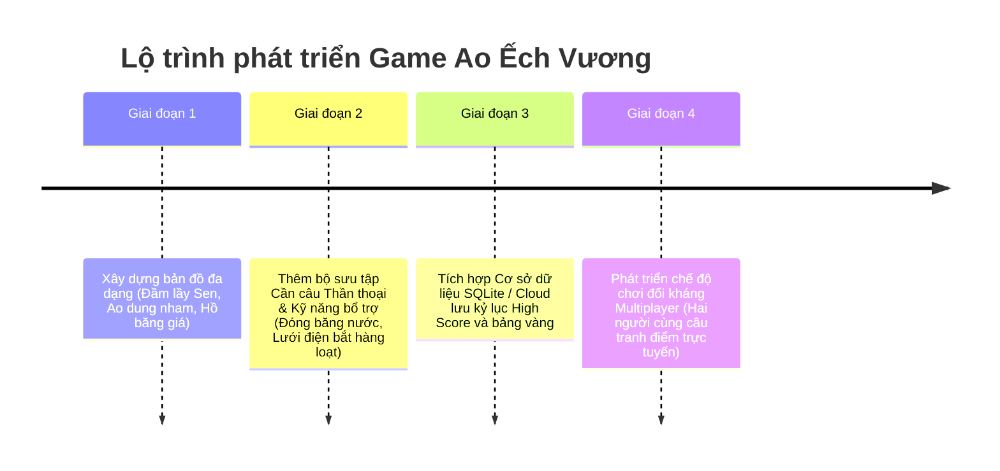

# BÁO CÁO BÀI TẬP LỚN (BTL.06): DỰ ÁN GAME CÂU ẾCH KỲ ẢO

*   **Tên đề tài**: Thiết kế và xây dựng game "Ao Ếch Huyền Bí" (Fantasy Frog Fishing)
*   **Mã đề tài**: BTL.06
*   **Ngôn ngữ triển khai**: HTML5/CSS3/JavaScript (Bản Web playable) & C++ OOP/SFML (Mã nguồn nộp bài tập lớn)
*   **Đối tượng hướng tới**: Học phần Lập trình hướng đối tượng (OOP) & Kỹ thuật lập trình.

---

## 1. PHÂN TÍCH YÊU CẦU (REQUIREMENTS ANALYSIS)

Dự án game "Ao Ếch Huyền Bí" được phân tích yêu cầu kỹ lưỡng trên cả hai phương diện: **Yêu cầu chức năng** và **Yêu cầu phi chức năng**.

### A. Yêu cầu Chức năng (Functional Requirements)
Hệ thống game đáp ứng đầy đủ các Use Case cốt lõi mô tả trong đề tài bài tập lớn:

| STT | Use Case / Chức Năng | Chi Tiết Nghiệp Vụ |
| :--- | :--- | :--- |
| **1** | **Căn góc và lực quăng mồi** | Người chơi nhấn giữ chuột trái và kéo lùi để điều chỉnh hướng và lực quăng mồi câu. Hệ thống hiển thị đường cong nét đứt dự báo parabol động. |
| **2** | **Vật lý bay & chìm** | Lưỡi câu bay theo quỹ đạo parabol trong không trung chịu ảnh hưởng của Trọng lực ($g$) và Sức gió giật ($v_{\text{wind}}$). Khi chạm nước, lưỡi câu chìm từ từ chịu lực cản nước lớn. |
| **3** | **Cá biệt hóa loài Ếch** | Hệ thống quản lý đa dạng loài ếch: <br>- *Ếch thường*: Di chuyển chậm, dễ bắt.<br>- *Ếch vàng/Ninja*: Tốc độ cao, có cơ chế phản xạ nhảy né lưỡi câu.<br>- *Ếch gai độc*: Vật cản, câu nhầm bị trừ điểm/vàng.<br>- *Ếch ma thuật*: Chỉ xuất hiện đêm, đòi hỏi mồi đom đóm phát sáng.<br>- *Boss Ếch Vương*: Siêu khổng lồ bám đáy ao. |
| **4** | **Trận chiến Boss (Tug-of-War)**| Khi chạm trúng Boss, game kích hoạt minigame giằng co lực kéo. Người chơi nhấp liên tục/nhấn Space để giữ lực Tension nằm trong vùng Safe Zone trượt qua lại liên tục. |
| **5** | **Thời tiết & Chu kỳ Ngày Đêm**| - *Chu kỳ Ngày/Đêm*: Bình minh -> Hoàng hôn -> Đêm. Đêm xuống mở khóa ếch ma thuật.<br>- *Thời tiết mưa/nắng*: Trời nắng ếch nấp kỹ dưới sen. Trời mưa ếch ra nhiều hơn nhưng trơn trượt có 22% cơ hội sẩy mất khi kéo lên sát bờ. |
| **6** | **Nâng cấp & Cửa hàng** | Sử dụng vàng thu hoạch để nâng cấp Cần câu (ném xa hơn), Dây câu (chịu lực căng Tension cao hơn), Vợt lưới (tăng bán kính đớp). Mua thêm mồi đặc biệt (Ruồi, Nhện, Đom đóm). |
| **7** | **Chế độ chơi (Game Modes)** | - *Time Attack*: Chạy đua đạt điểm tối đa trong 90 giây.<br>- *Survival*: Giới hạn mồi câu, câu hỏng bị phạt mạng thời gian, câu trúng được hồi giây. |

### B. Yêu cầu Phi chức năng (Non-functional Requirements)
*   **Hiệu năng & Tốc độ**: Game loop vận hành mượt mà ở tần số quét cao **120 FPS**, phản hồi độ trễ cực thấp (< 8ms), tối quan trọng đối với các game đòi hỏi phản xạ nhanh.
*   **Trải nghiệm người dùng (UI/UX)**: Đồ họa mang phong cách kỳ ảo (Fantasy), áp dụng ngôn ngữ thiết kế kính mờ hiện đại (Glassmorphism), có màu sắc phát sáng neon dạ quang thu hút thị giác.
*   **Tính di động (Portability)**: Bản Web game có khả năng chạy độc lập ngoại tuyến (offline) trên tất cả các trình duyệt phổ biến mà không đòi hỏi cài đặt môi trường phức tạp.
*   **Tính đóng gói mã nguồn (Maintainability)**: Mã nguồn C++ và JavaScript được module hóa chặt chẽ theo hướng đối tượng OOP để giáo viên dễ dàng chấm điểm và mở rộng dự án.

---

## 2. Ý NGHĨA CỦA GAME (GAME SIGNIFICANCE)

### A. Ý nghĩa Khoa học & Giáo dục (Academic Value)
Trò chơi là một minh chứng thực tế trực quan kết hợp giữa **Khoa học Vật lý đại cương** và **Lập trình hướng đối tượng (OOP)**:
*   **Ứng dụng Vật lý động lực học**: Giúp người học làm quen và trực quan hóa các phương trình chuyển động của vật bị ném xiên trong môi trường có lực cản phi tuyến tính (nước) và lực đẩy ngoại cảnh (gió thổi lệch tâm).
*   **Rèn luyện tư duy OOP**: Thay vì học các lý thuyết khô khan về kế thừa, đa hình, giao diện trừu tượng, trò chơi cung cấp một hệ thống thực tế nơi mọi thực thể đều kế thừa từ một lớp gốc, có hành vi riêng và được tương tác đồng bộ.

### B. Ý nghĩa Giải trí & Trải nghiệm (Casual Value)
*   Mang đến một lối chơi giải trí nhẹ nhàng lấy cảm hứng từ trò chơi câu cá/câu ếch tuổi thơ nhưng được nâng cấp bằng cơ chế giằng co kịch tính lúc đấu Boss.
*   Chủ đề thần tiên (Fantasy Pond) mộc mạc kết hợp âm thanh thư thái tạo cảm giác dễ chịu cho người chơi.

---

## 3. CÁCH DÙNG VÀ SỬ DỤNG (USAGE & CONTROLS GUIDE)

### A. Khởi động Game
1.  Truy cập thư mục mã nguồn **`FrogFishing`**.
2.  Mở tệp **`index.html`** trên trình duyệt Web bất kỳ để bắt đầu chơi lập tức.

### B. Hệ thống Phím điều khiển
*   **Thao tác Quăng Cần**: Nhấp chuột trái vào khu vực bờ cỏ (gần vị trí Người câu Elf nón lá), **giữ và kéo lùi chuột** để kéo căng lực ném (hiển thị đường parabol màu Cyan nét đứt). **Thả chuột ra** để phóng mồi đi.
*   **Thao tác Thu cần / Kéo dây**: Nhấp chuột trái liên tục để kéo lưỡi câu về nhanh hơn.
*   **Đấu tranh Boss**: Khi đớp trúng Boss, nhấn **phím Space** hoặc **Click chuột liên tục** để nâng kim Tension nằm trong vùng màu xanh lá.
*   **Chuyển đổi loại mồi nhanh**:
    *   Phím `1` hoặc `A`: Chọn **Giun đất** (Mồi cơ bản, vô hạn).
    *   Phím `2` hoặc `S`: Chọn **Ruồi bay** (Thích hợp săn ếch Ninja vàng).
    *   Phím `3` hoặc `D`: Chọn **Nhện ma** (Dụ Boss đáy hồ và câu trời nắng).
    *   Phím `4` hoặc `F`: Chọn **Đom đóm** (Phát sáng đêm, bắt buộc dùng để câu ếch Ma Thuật).
*   **Mở cửa hàng**: Click vào nút **"Cửa Hàng"** màu tím phát sáng trên HUD để mua mồi và nâng cấp.

---

## 4. KỸ THUẬT OOP ĐÃ SỬ DỤNG (OOP PARADIGMS APPLIED)

Dự án áp dụng triệt để **4 tính chất nền tảng của Lập trình Hướng đối tượng**:

```
                  +--------------------------------+
                  |      GameObject (Abstract)     |
                  +--------------------------------+
                  | # x, y, vx, vy, width, height  |
                  | + virtual update(dt) = 0       |
                  | + virtual draw(window) = 0     |
                  +--------------------------------+
                                  |
         +------------------------+------------------------+
         |                        |                        |
+------------------+     +------------------+     +------------------+
|    Frog (Ếch)    |     |   Hook (Lưỡi)    |     | Fish/Bird (Cản)  |
+------------------+     +------------------+     +------------------+
| - type, facing   |     | - state, tension |     | - gravity        |
| + randomWalk()   |     | + launch()       |     | + update(dt)     |
| + dive(), escape()|    | + updatePhysics()|     |                  |
+------------------+     +------------------+     +------------------+
```

### A. Tính Trừu tượng (Abstraction)
Thể hiện qua lớp gốc trừu tượng **`GameObject`**. Lớp này đóng vai trò là khuôn mẫu cho tất cả các đối tượng chuyển động trên màn hình. Lớp chứa các thuộc tính tọa độ (`x`, `y`), vận tốc (`vx`, `vy`) và khai báo các phương thức ảo thuần túy (Pure Virtual Functions):
```cpp
virtual void update(float dt) = 0;
virtual void draw(RenderWindow& window) = 0;
```
Người thiết kế không cần biết chi tiết từng đối tượng vẽ thế nào, chỉ cần biết mọi đối tượng chuyển động đều phải có hai hành vi cập nhật logic và vẽ chính nó.

### B. Tính Kế thừa (Inheritance)
Các thực thể cụ thể như `Frog` (Ếch), `Hook` (Lưỡi câu), `Fish` (Cá chướng ngại vật), và `Bird` (Chim ăn mồi) đều kế thừa trực tiếp từ lớp cha `GameObject`. 
*   Các lớp con được tái sử dụng toàn bộ các thuộc tính tọa độ, kích thước của lớp cha.
*   Lớp con tự bổ sung các thuộc tính và phương thức nghiệp vụ đặc trưng riêng (Ví dụ: `Frog` có thuộc tính `type`, phương thức `randomWalk()`, `dive()`; `Hook` có thuộc tính `tension`, phương thức `launch()`).

### C. Tính Đa hình (Polymorphism)
Đây là tính chất cốt lõi giúp tối ưu hóa Game Loop. Lớp quản lý `Game` lưu trữ toàn bộ các thực thể động dưới một danh sách con trỏ kiểu lớp cha:
```cpp
std::vector<std::shared_ptr<GameObject>> objects;
```
Trong hàm cập nhật hệ thống và vẽ đồ họa, Game Loop chỉ cần duyệt qua danh sách và gọi phương thức của lớp cha:
```cpp
for (auto& obj : objects) {
    obj->update(dt);
    obj->draw(window);
}
```
Tại thời điểm chạy (Runtime), chương trình sẽ tự động liên kết động để gọi đúng phương thức `update()` và `draw()` riêng biệt của `Frog`, `Fish`, hay `Bird` tùy thuộc vào kiểu thực thể thực sự của con trỏ đó.

### D. Tính Đóng gói (Encapsulation)
Mọi dữ liệu thuộc tính của các lớp đều được thiết lập phạm vi truy cập bảo vệ (`private` hoặc `protected`) để tránh việc các đối tượng bên ngoài can thiệp làm sai lệch dữ liệu (Ví dụ: thuộc tính `tension` của `Hook` chỉ có thể được tăng giảm thông qua các phương thức kéo dây, không thể bị gán trực tiếp bừa bãi). Các lớp bên ngoài muốn đọc dữ liệu phải thông qua các hàm trung gian Getter/Setter (Ví dụ: `getState()`, `getPosition()`).

---

## 5. ƯU VÀ NHƯỢC ĐIỂM (PROS AND CONS)

### A. Ưu điểm (Pros)
*   **Hiệu năng vượt trội**: Game chạy mượt mà ở tốc độ quét lên tới 120 FPS nhờ tối ưu hóa vòng lặp render trên HTML5 Canvas phẳng và tính toán số học tối giản.
*   **Cơ chế Vật lý Chân thực**: Mô phỏng ném parabol kết hợp sức cản nước phi tuyến và hướng gió động tạo ra độ thử thách cao, tránh sự nhàm chán của các game arcade thông thường.
*   **Thiết kế Mỹ thuật xuất sắc**: Áp dụng ngôn ngữ thiết kế Fantasy Glassmorphism sang trọng với các hiệu ứng hạt ánh sáng đom đóm, hoa sen hồng nở rộ bập bềnh và đặc biệt là hoạt ảnh **Người câu Elf ngả người/rung lắc** cực kỳ sinh động.
*   **Âm thanh Độc lập**: Tự động tổng hợp âm thanh (Whoosh, Splash, Catch, Snap) thời gian thực bằng tần số sóng âm `AudioContext` của trình duyệt, chạy offline 100% không cần tải file ngoài.
*   **Tính sẵn sàng học thuật**: Cấu trúc mã nguồn C++ đồng bộ hóa cấu trúc OOP lớp chuẩn xác giúp sinh viên dễ dàng dùng làm bài tập lớn nộp nhà trường.

### B. Nhược điểm (Cons)
*   **Hạn chế Kịch bản**: Hiện tại game mới chỉ hỗ trợ 1 ao sen bản đồ chính. Chưa có nhiều cảnh quan khác nhau.
*   **Lưu trữ cục bộ giới hạn**: Điểm số kỷ lục và vàng nâng cấp mới chỉ được lưu tạm thời trong bộ nhớ phiên chơi, chưa đồng bộ hóa đám mây hay cơ sở dữ liệu vĩnh viễn.

---

## 6. KẾ HOẠCH PHÁT TRIỂN TRONG TƯƠNG LAI (FUTURE ROADMAP)

Để đưa trò chơi đạt chuẩn thương mại hóa và mở rộng trải nghiệm người dùng, nhóm phát triển đề xuất lộ trình nâng cấp sau:



1.  **Mở rộng Bản đồ (Multi-map support)**:
    *   *Ao Dung Nham*: Tăng nhiệt độ, xuất hiện ếch lửa, dây câu dễ bị cháy đứt nhanh hơn.
    *   *Hồ Băng Giá*: Nước đóng băng cục bộ, đòi hỏi căn góc quăng ném đập vỡ tảng băng để câu ếch bên dưới.
2.  **Hệ thống kỹ năng bổ trợ (Active Skills)**:
    *   *Đóng băng thời gian*: Làm chậm chuyển động của ếch Ninja để dễ ngắm bắn.
    *   *Sóng siêu âm*: Phát hiện các chú ếch đang lặn sâu ẩn náu dưới bùn sen.
3.  **Tích hợp Cơ sở dữ liệu lưu trữ (Persistent Storage)**:
    *   Sử dụng SQLite hoặc Web LocalStorage để lưu trữ vĩnh viễn cấp độ nâng cấp trang bị, lượng mồi dư thừa và Bảng Vàng Anh Hùng (High Scores).
4.  **Chế độ Chơi mạng (Co-op & Versus Multiplayer)**:
    *   Áp dụng giao thức WebSocket để xây dựng chế độ câu ếch đối kháng thời gian thực giữa hai người chơi trên cùng một đầm sen.
