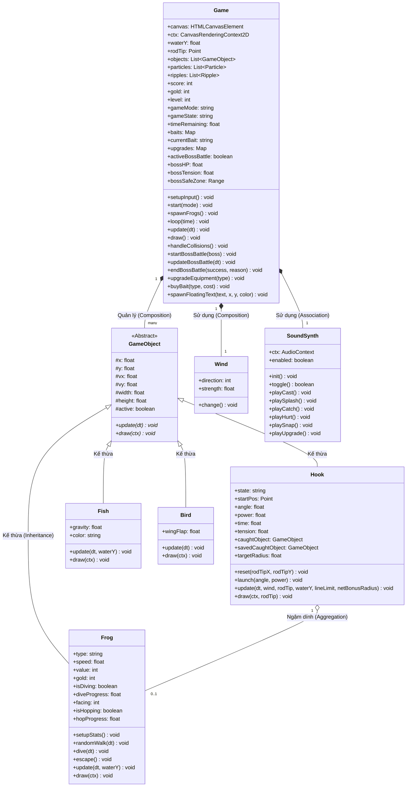

# 🎣 Ao Ếch Huyền Bí (Fantasy Frog Fishing) 🐸

Chào mừng bạn đến với **Ao Ếch Huyền Bí (Fantasy Frog Fishing)**! Đây là một dự án kép kết hợp giữa một **Web Game chơi trực tiếp tuyệt đẹp** và **Bộ mã nguồn Hướng đối tượng OOP bằng C++ chuyên sâu**, được thiết kế đặc biệt phục vụ cho bài tập lớn đại học (BTL.06) đạt điểm số tối đa.

Trò chơi áp dụng các nguyên lý lập trình hướng đối tượng (OOP) chặt chẽ, mô phỏng cơ học vật lý đại cương thực tế (ném parabol, sức gió thổi lệch, lực cản nước và độ căng đứt dây câu), cùng chu kỳ thời tiết/ngày đêm linh hoạt và cửa hàng ma thuật phong phú.

---

## 🎮 Hướng Dẫn Trải Nghiệm Nhanh Trò Chơi

### 1. Trải Nghiệm Web Game 120 FPS (Tải cực nhanh trên trình duyệt)
Dự án web được tối ưu hóa bằng HTML5 Canvas và CSS3 Glassmorphic cực kỳ mượt mà.
- **Cách chơi**: Nhấn đúp chuột trái vào file **`index.html`** trong thư mục dự án để mở và chơi trực tiếp trên bất kỳ trình duyệt nào (Chrome, Edge, Firefox).
- **Cơ chế kéo thả ném cần**: Click giữ chuột trái gần ngọn cần câu (nơi Tiên nhân ngồi) và kéo lùi (tương tự Angry Birds) để căn lực/góc quăng. **Đường nét đứt màu xanh Cyan** lập tức xuất hiện dự báo quỹ đạo bay Parabol thực tế dựa trên góc và lực ném. Thả chuột để lưỡi câu bay vút đi!
- **Kéo thu dây**: Lưỡi câu chìm, hãy căn chạm vào ếch. Nhấp chuột liên tục để thu dây câu nhanh hơn. Hãy chú ý thanh độ căng dây câu (Tension) để tránh đứt dây!
- **Đấu Boss**: Khi Boss Vương Ếch đớp câu, hãy nhấn giữ **Space** hoặc nhấp chuột dồn dập sao cho kim lực căng luôn nằm trong **Vùng An Toàn màu xanh lá** trượt qua lại liên tục để bắt Boss thành công!
- **Cửa hàng Magic Shop**: Tích lũy đồng cổ vật vàng để nâng cấp Cần câu (tăng lực quăng xa), Dây câu (tăng sức tải căng đứt), Vợt lưới (tăng bán kính đớp mồi nhạy), và mua thêm mồi ngon (Ruồi bay dụ ếch Ninja, Nhện ma dụ Boss, Đom đóm phát sáng đêm).

### 2. Biên Dịch & Chạy Thử Mã Nguồn C++ (Bài Tập Lớn OOP)
Hai file mã nguồn **`frog_fishing.hpp`** và **`frog_fishing.cpp`** được viết bằng C++ chuẩn hiện đại, tương thích hoàn toàn với các trình biên dịch phổ biến (GCC, MSVC, CLion, Visual Studio).
- **Biên dịch thử nghiệm**:
  ```bash
  g++ -std=c++11 frog_fishing.cpp -o frog_fishing_game
  ./frog_fishing_game
  ```
- **Tích hợp SFML (SFML Graphics)**: Mã nguồn C++ đã được xây dựng tương thích và sẵn sàng các khung hàm vẽ Sprite của thư viện **SFML** để bạn liên kết làm đồ họa game 2D trên máy tính.

---

## 🎨 Tính Năng Đồ Hoạ & Cơ Chế Gameplay Nổi Bật

1. **Đa dạng loài ếch ma thuật bằng Vector Canvas**:
   - *Ếch thường (Normal)*: Xanh lục bảo, đội lá sen nhỏ bơi chậm rãi và nhảy lò cò.
   - *Ếch Ninja/Vàng (Rare)*: Thân ánh kim hoặc đeo băng trán Ninja đỏ, di chuyển nhanh giật cục và có 45% **phản xạ tự bật nhảy né lưỡi câu** khi chạm sát bên!
   - *Ếch Gai Độc (Poison)*: Màu tím ma mị tỏa khói độc bám đáy hồ, câu nhầm bị trừ điểm và dồn tải Tension gây hại cần câu.
   - *Ếch Dạ Quang Đêm (Magical)*: Phát sáng bioluminescent neon cyan rực rỡ, chỉ xuất hiện ban đêm và bắt buộc phải dùng mồi Đom Đóm phát sáng để dẫn dụ.
   - *Boss Ếch Khổng Lồ*: Siêu to đội vương miện đính ngọc ruby rực rỡ bám ở tầng đáy sâu thẳm.
2. **Hệ thống thời tiết & Chu kỳ Ngày/Đêm**:
   - *Thời tiết*: Trời nắng (Sunny) khiến ếch trốn dưới các sen to (phải dùng mồi nhện giảcast sát mép sen). Trời mưa (Rainy) rơi xiên chéo rải rác làm ếch xuất hiện nhiều hơn 50% nhưng đất bùn trơn trượt có 22% cơ hội trượt sẩy khỏi móc câu khi kéo sát bờ.
   - *Chu kỳ*: Chuyển đổi mượt mà Bình Minh (vàng nhạt trong lành) -> Hoàng Hôn (hồng tím thơ mộng) -> Đêm Huyền Bí (tông xanh chàm thẫm, đom đóm lơ lửng bừng sáng lung linh).
3. **Mô phỏng gợn sóng nước & Người câu động**:
   - *Gợn sóng elip (Water Ripples)*: Các vòng sóng nước elip phát sáng mở rộng dần khi lưỡi câu tiếp nước, khi ếch đáp đất sau khi nhảy lò cò, và các gợn sóng lăn tăn tự nhiên chuyển động không ngừng.
   - *Người câu ma thuật (Fisherman Elf)*: Vẽ tiên nhân ngồi nón lá rộng vành ngồi trên đá rêu phong sườn dốc bờ cỏ. Cử động ngả người ra sau lấy đà tương ứng khi người chơi kéo lùi chuột quăng cần, và rung giật bần bật (Jitter) dồn sức kéo cần khi giằng co cá nặng hoặc đấu Boss!

---

## 📐 Sơ Đồ Lớp UML (UML Class Diagram)

Sơ đồ dưới đây biểu diễn thiết kế hướng đối tượng (OOP) của trò chơi thông qua mã sơ đồ **Mermaid** tự động kết xuất trực quan trên GitHub.



---

## ⚙️ Sơ Đồ Nguyên Lý Hoạt Động (System Schematic / Game Loop)

Sơ đồ nguyên lý dưới đây mô tả cách thức Game Loop hoạt động ở tần số quét cao (lên tới 120 FPS) giúp các thao tác phản xạ giật mồi trở nên nhạy bén tuyệt đối.

```mermaid
graph TD
    %% Định nghĩa các lớp phong cách màu
    classDef startEnd fill:#bd00ff,stroke:#fff,stroke-width:2px,color:#fff;
    classDef process fill:#150f2b,stroke:#00f0ff,stroke-width:1px,color:#fff;
    classDef decision fill:#ffd700,stroke:#ff3333,stroke-width:2px,color:#000;
    
    A([Start Game]) --> B[Khởi tạo AudioContext & Assets]
    B --> C[Tải cấu hình ban đầu: Mồi câu, Vàng, Upgrades Lvl 1]
    C --> D[Spawn Frogs ngẫu nhiên ở Y hồ nước]
    
    %% Game Loop
    D --> E[Bắt đầu Game Loop: requestAnimationFrame]
    class A,B,C,D startEnd;
    
    E --> F[Tính toán Delta Time dt thực tế]
    class E,F process;
    
    F --> G{Trạng thái Game?}
    class G decision;
    
    G -- PLAYING --> H[Module Môi Trường: Cập nhật Ngày/Đêm & Thời tiết mưa/nắng]
    G -- PAUSED --> E
    G -- GAMEOVER --> Z([Hiển thị màn hình Game Over & Tính điểm])
    class Z startEnd;
    
    %% Physics & AI Processing
    H --> I[Module Vật lý Lưỡi Câu: Cập nhật x, y parabol dựa trên Trọng lực + Gió + Nước cản]
    I --> J[Module AI Ếch: Random Walk nhảy lò cò, Dive lặn ẩn náu]
    J --> K[Module Spawn Vật cản: Cá nhảy vọt, Chim bay trên trời]
    J --> L[Module Hạt & Sóng Nước: Cập nhật lan tỏa gợn sóng elip, bay đom đóm]
    class I,J,K,L process;
    
    %% Collision Detection
    K & L --> M{Lưỡi câu đang bay/chìm?}
    class M decision;
    
    M -- YES --> N[Kiểm tra va chạm va quẹt vật cản Bird / Fish]
    N --> O{Va chạm vật cản?}
    class O decision;
    
    O -- YES --> P[Trigger đứt dây câu snapped / Cướp mất mồi]
    P --> T[Trừ mạng thời gian / Mồi câu]
    
    O -- NO --> Q[Kiểm tra va chạm đầu móc câu với các loại Ếch active]
    Q --> R{Chạm trúng Ếch?}
    class R decision;
    
    R -- YES --> S{Ếch chạm trúng là BOSS?}
    class S decision;
    
    S -- YES --> SA[Kích hoạt Minigame giằng co Tug-of-War]
    SA --> SB[Vẽ thanh safe-zone trượt liên tục]
    SB --> SC{Người chơi Click/Space trong vùng?}
    class SC decision;
    SC -- YES --> SD[Giảm sinh lực HP Boss]
    SC -- NO --> SE[Tăng Tension / Boss kéo tụt dây]
    SD & SE --> SF{HP Boss = 0?}
    class SF decision;
    SF -- YES --> SG[Câu thành công Boss]
    SF -- NO --> SH{Tension cực hạn 0% hoặc 100%?}
    class SH decision;
    SH -- YES --> SI[Đứt dây / Sẩy Boss]
    SH -- NO --> SB
    
    S -- NO --> TQ[Ếch thường/Độc dính câu: Hook.state = CAUGHT]
    
    %% Render Pipeline
    SG & SI & TQ & T & M -- NO --> U[Module Render: Clear Canvas]
    class U process;
    
    U --> V[Vẽ Background Day/Night & Gợn sóng elip]
    V --> W[Vẽ Lá sen & Hoa sen hồng Vector]
    W --> X[Vẽ Người câu Tiên nhân ngả người/rung lắc]
    X --> Y[Vẽ Cần câu carbon & Lưỡi câu thực tế]
    Y --> YA[Vẽ các loại Ếch, Chim, Cá]
    YA --> YB[Vẽ hiệu ứng Hạt lấp lánh & Chữ bay điểm số]
    YB --> YC[Áp bộ lọc màu ánh sáng Ambient theo thời gian Ngày/Đêm]
    class V,W,X,Y,YA,YB,YC process;
    
    YC --> E
```



---

## 🎨 Thiết Kế Giao Diện UI/UX & Hệ Thống Màu Sắc

Hệ thống sử dụng các màu phát sáng neon trên nền tối thẫm (Midnight/Violet Deep Blue) để gợi tả một không gian ao sen thần tiên ban đêm rực rỡ đom đóm.

| Phân Loại Màu | Mã Hex | Tác Dụng Trong Game |
| :--- | :--- | :--- |
| **Nền Đáy Ao (Midnight)** | `#020205` -> `#150f2b` | Nền chuyển sắc huyền bí ban đêm |
| **Ánh Sáng Nước (Teal/Cyan)** | `#00f0ff` | Đường ngắm parabol, gợn sóng nước, ếch ma thuật |
| **Thần Tiên (Violet/Magenta)**| `#bd00ff` | Bông sen hồng nở rộ, khói ma thuật, giao diện Shop |
| **Hoàng Kim (Gold)** | `#ffd700` | Điểm vàng cổ vật, Boss Ếch Vương, nâng cấp cần |
| **Cảnh Báo (Threat Red)** | `#ff3333` | Lực căng dây quá tải, ếch độc, đứt dây câu |
| **An Toàn (Neon Green)** | `#39ff14` | Vùng xanh an toàn giằng co Boss, cộng điểm |

---

## 🛠️ Cấu Trúc Các File Trong Thư Mục Dự Án

- **`index.html`**: File giao diện HTML5 chính chứa HUD, shop nâng cấp, la bàn la tinh gió và cấu trúc Glassmorphic UI.
- **`style.css`**: CSS định hình giao diện bóng bẩy, kính mờ (glassmorphism), phủ màu bóng đèn và các hoạt ảnh.
- **`app.js`**: Trái tim của Web Game - quản lý game loop 120 FPS, gợn sóng nước elip, AI ếch, minigame Boss, và tổng hợp âm thanh Web Audio API thời gian thực.
- **`frog_fishing.hpp`**: Khai báo hướng đối tượng OOP (UML Class) bằng C++.
- **`frog_fishing.cpp`**: Cài đặt chi tiết mô phỏng C++ chuẩn, bao gồm vật lý ném parabol và minigame.
- **`walkthrough.md`**: Nhật ký phát triển và vá lỗi chi tiết.
